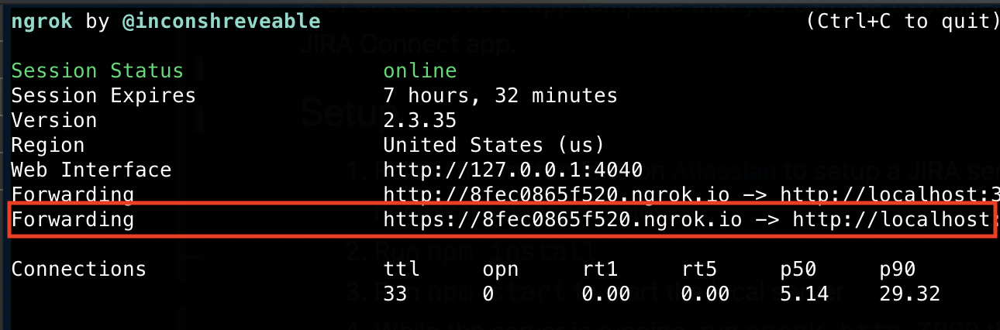

# cra-jira-plugin

A `create-react-app` template that you can use to connect and create a JIRA Connect app.

## Setup 
1. Follow the instuctions on [Atlassian](https://developer.atlassian.com/cloud/jira/platform/getting-started/) to setup a JIRA server and install necessary dependencies.
2. Run `npm install`
3. Run `npm start` to start the local server
4. While the server is running, run `ngrok http 3000` this will make our port 3000 available to the internet.
5. Copy the https forwarding url.

6. Paste the url as the `baseurl` in [atlassian-connect.json](public/atlassian-connect.json)
7. Go to your JIRA instance and click upload app. Enter the URL of your app that you just pasted as the baseurl and append /atlassian-connect.json
     
     * Ex `https://https://8fec0865f520.ngrok.io/atlassian-connect.jxon`
8. From the app menu, you should be able to select your app and see the create-react-app screen
9. Profit! 💰💰

